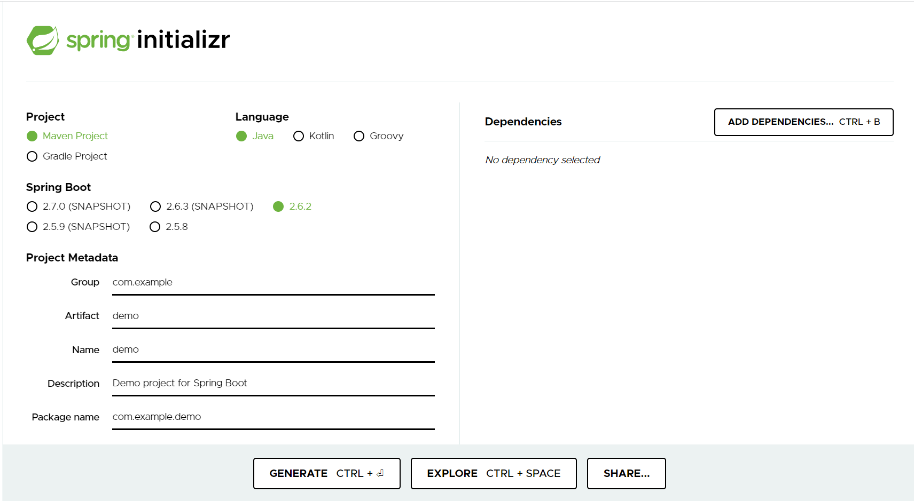

# 학습방법
1. 프로젝트 생성
2. 라이브러리 살펴보기
3. 요구사항에 따른 설계

# 프로젝트 생성
https://start.spring.io/ 

# 라이브러리 살펴보기

gradle 에서 의존성 확인 가능

# 요구사항

초기 요구사항은 다음과 같다.

요구사항중 미확정 요구사항이 있기 때문에 생각하며 설계.

# 설계

먼저 설계를 Domain - Repository - Service - Controller 순으로 설계

## 도메인 설계

main안에서 domain 패키지를 생성하고  
그 안에서 사용하는 도메인인 Grade, Member 생성

  
  Grade는 BASIC, VIP 두가지 등급만

Member는 다음과 같다. 생성자과 Getter,Setter를 모두 설정해줘야하는데
이것은 나중에 Lombok을 사용하면 스프링이 알아서 해주게 할 수 있다.

## 저장소 설계

임시로 메모리회원저장소 생성.  
HashMap은 동시성 이슈가 발생할 수 있으나 ConcurrentHashMap 사용시 해결

## 서비스 설계

메인을 만들어서 확인 일치하는 것을 알수있다  

그러나 이렇게하면 OCP, DIP를 지키지 못한다.....
다른 로직으로 계속해서 이어간다.

# 출처
인프런 - 김영한님 강의

(https://www.inflearn.com/course/%EC%8A%A4%ED%94%84%EB%A7%81-%ED%95%B5%EC%8B%AC-%EC%9B%90%EB%A6%AC-%EA%B8%B0%EB%B3%B8%ED%8E%B8/dashboard)

